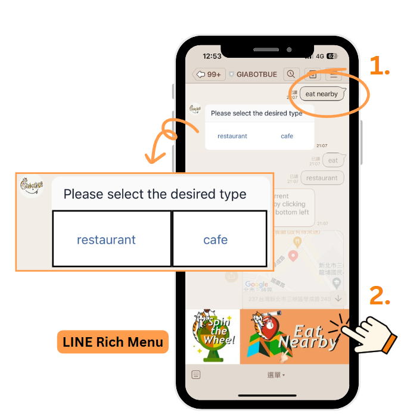
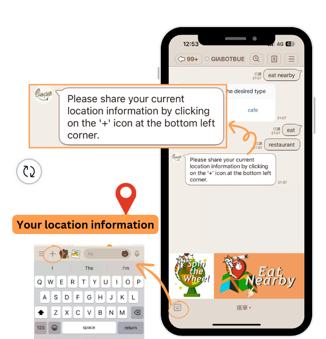
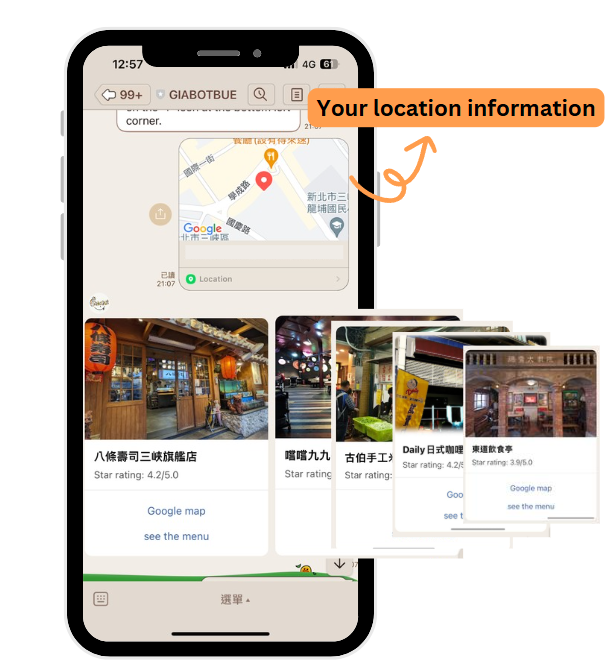
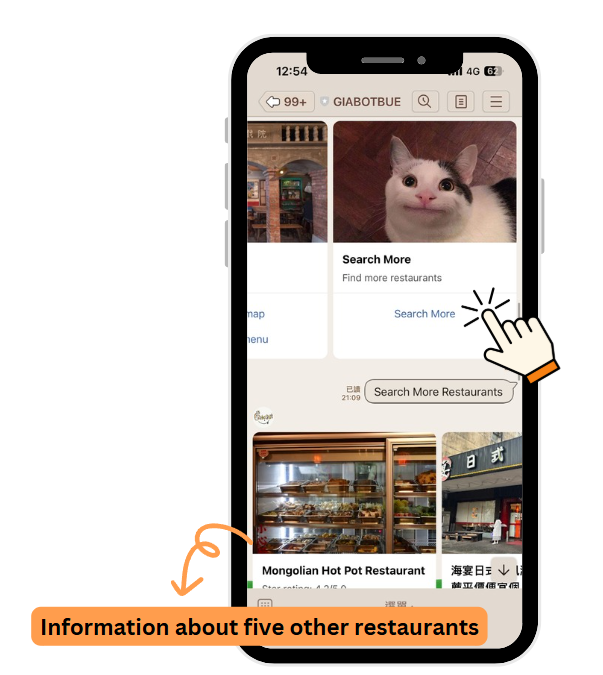

# GIABOTBUE
You have to change the following contents of settings.py:

LINE_CHANNEL_ACCESS_TOKEN = 'Channel access token'

LINE_CHANNEL_SECRET = 'Channel secret'

GOOGLE_PLACES_API_KEY = 'google place api'

輸入『eat nearby』或點擊下方圖片
有兩個選項：餐廳和咖啡廳

在下方的功能列中找到加號 ‘ + ’ 提供其位置資訊

輸入位置資訊後會顯示五張餐廳卡片

Click ‘Search More’

